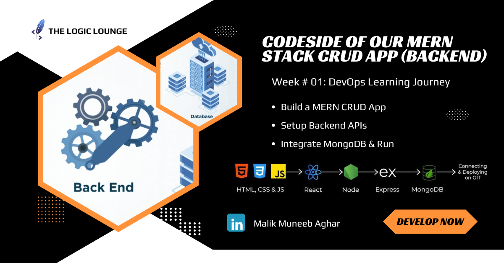

# MERN CRUD Application(Backend Part)
DevOps Learning Journey - Week # 01




Welcome to the MERN CRUD Application repository! This project demonstrates how to build a full-stack CRUD (Create, Read, Update, Delete) application using the MERN stack (MongoDB, Express.js, React.js, Node.js).

## Prerequisites

Before getting started, ensure you have the following installed on your machine:
- Node.js
- MongoDB
- npm (Node Package Manager)

## Getting Started

### 1. Clone the Repository

```bash
git clone https://github.com/yourusername/mern-crud-app.git
cd mern-crud-app
```
### 2. Install Dependencies
```bash
npm install
```

### 3. Set Up Environment Variables
Create a `.env` file in the root directory and add the following configuration (replace values with your own):
```bash
PORT=6010
MONGODB_URI=your_mongodb_connection_string
BASE_URL=http://localhost:6010  # Replace with your development server URL
```

### 4. Run the Backend Server
```bash
node app.js
```
The backend server will start at http://localhost:6010.

### Usage:

Once the servers are running, you can access the application in your web browser. Here are the available endpoints:

```bash 
Register User: POST http://localhost:6010/user/register

Fetch Users: GET http://localhost:6010/user/details

Fetch Single User: GET http://localhost:6010/user/:id

Update User: PUT http://localhost:6010/user/edit/:id

Delete User: DELETE http://localhost:6010/user/delete/:id

Change User Status: PUT http://localhost:6010/user/status/:id

Export Users to CSV: GET http://localhost:6010/userexport
```
### Contributing:
Contributions are welcome! If you'd like to contribute to this project, follow these steps:

```bash
Fork the repository.

Create a new branch (git checkout -b feature-branch).

Make your changes.

Commit your changes (git commit -am 'Add feature').

Push to the branch (git push origin feature-branch).

Create a new Pull Request.
```
## Understanding the Concepts

For a detailed step-by-step guide and in-depth understanding of the concepts covered in this repository, please read the full blog. It provides additional insights, explanations, and resources to help you grasp the fundamentals of building a MERN CRUD application.

[Read Full Blog](https://muneebcloudeng.hashnode.dev/week-01-devops-learning-journey-codeside-of-our-mern-stack-crud-app-backend)


